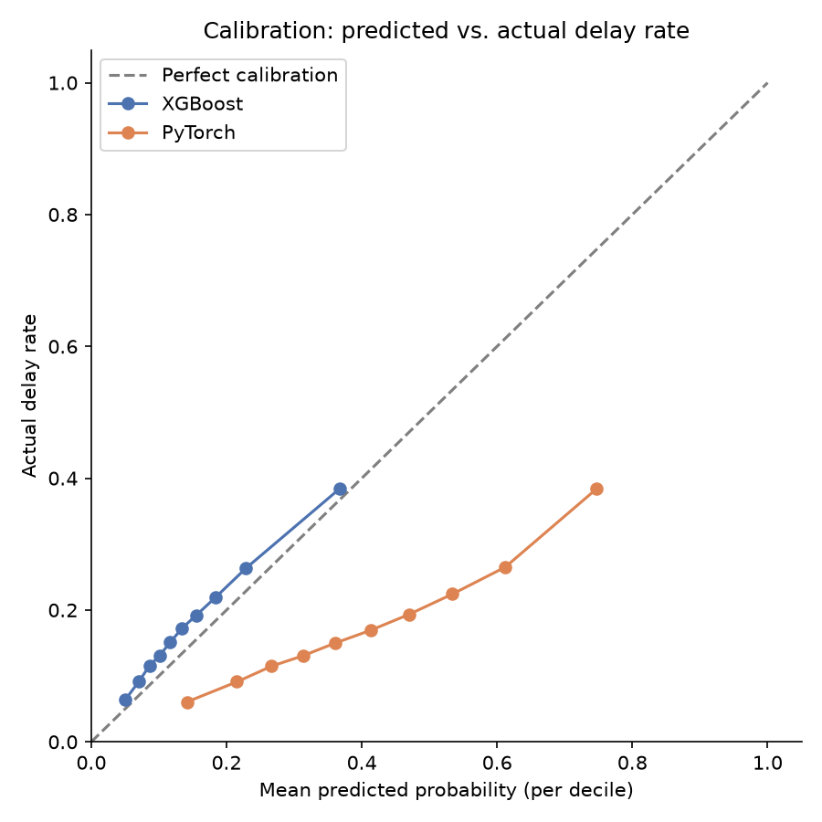
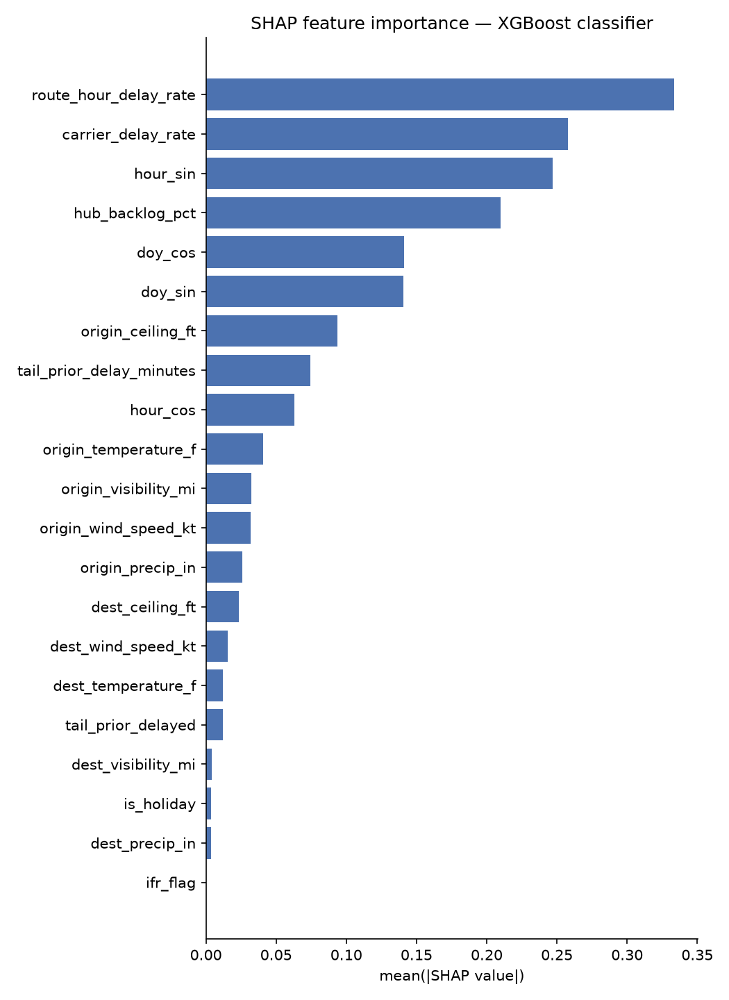
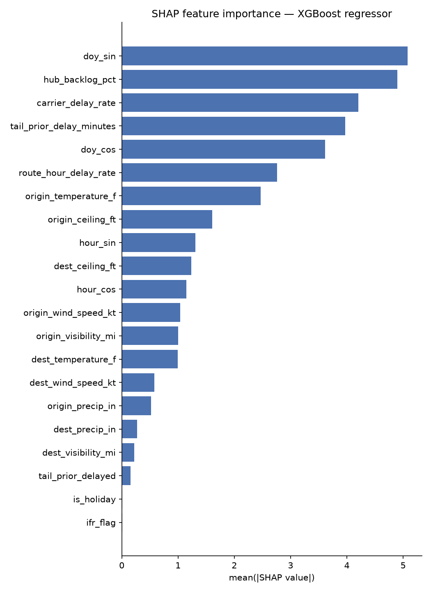

# Flight Delay Prediction

Predicts whether a US domestic flight will be delayed 15+ minutes, and if so
by how many minutes, using only information available **4 hours before
scheduled departure (T-4h)**. Given a flight and that cutoff, the system
outputs two numbers together:

> **78% chance of delay, expected ~22 minutes late**

This is a portfolio project built to demonstrate real ML judgment rather than
a Kaggle-style "train XGBoost, report accuracy" exercise: careful
point-in-time feature engineering with no leakage, a real baseline that both
trained models must beat, honest (not cherry-picked) evaluation, and a model
that's actually served behind an API.

Scope: the top 15 US hub airports (ATL, DFW, DEN, ORD, LAX, JFK, LAS, MCO,
MIA, CLT, SEA, PHX, EWR, SFO, IAH), full calendar year 2024, ~2.9M flights in
the modeling population after filtering to flights actually departing a hub.

## The weather look-ahead trap

You cannot use the weather observation at flight time to predict a flight
before it departs — that observation is the weather that *caused or
coincided with* the delay, so using it is leakage dressed up as a feature.

The fix: every weather feature (temperature, wind, precipitation, visibility,
ceiling, and the derived IFR flag) comes from the NOAA METAR observation
timestamped at or before T-4h, at both origin and destination, joined with a
Polars `join_asof(strategy="backward")` against the cutoff timestamp — never
against the scheduled or actual departure time.

A second, easy-to-miss version of the same trap: BTS on-time data is
DST-aware local time, but NOAA's LCD weather product uses a fixed local
standard offset year-round. Comparing the two as if they were on the same
clock silently misaligns the weather-to-flight join by an hour for roughly
eight months of the year. Both sources are converted to UTC independently
(BTS via each airport's IANA timezone, NOAA via its fixed standard offset)
before any join happens — see `data/ingest_bts.py` and `data/airports.py`.

## The two headline features

**Tail-number delay propagation** — was this specific aircraft's most
recently completed flight delayed, and by how much? Implemented as an
as-of join keyed on `(Tail_Number, airport)`, matching a candidate prior
flight's `Dest` against the current flight's `Origin` and gating on the
prior flight's actual *arrival* time (not departure) — arrival guarantees
the leg is fully complete, so its delay is a known, final quantity. This
also fixes a real bug from an earlier version of the function, which joined
on tail number alone with no airport check and could credit a flight with a
"prior delay" from an aircraft that most recently landed somewhere else
entirely. Diverted flights are excluded from this join's history: BTS keeps
`Dest` as the *originally scheduled* airport even when the aircraft actually
landed elsewhere, so trusting it there would seat the aircraft at an airport
it never reached.

**Hub network backlog index** — the percentage of flights that departed the
same origin airport delayed in the 3 hours before cutoff, i.e. "are delays
cascading through this airport right now." Computed as a cumulative-count
as-of join rather than a self-join (a self-join is O(n²) per airport and
does not finish at real BTS scale); a window's count is `cumulative(b) -
cumulative(a)` from two backward as-of joins against a running per-airport
cumulative sum.

Both features, along with the moving-window route/hour and carrier target
encodings, are also where the project's one real, hard-won bug surfaced —
see [What running this against real data actually caught](#what-running-this-against-real-data-actually-caught).

## Results

### Classification — delay probability

Time-based split: train on Jan 1 – Sep 15 2024 (70%, ~2.05M flights), test on
Sep 15 2024 – Jan 1 2025 (30%, ~878K flights). Never shuffled across time.

| Model | ROC-AUC | PR-AUC | Brier | Catch-rate @ 20% false-alarm rate |
|---|---|---|---|---|
| Baseline (route/hour historical delay rate) | 0.626 | 0.261 | 0.147 | 36.2% |
| XGBoost | 0.667 | 0.320 | **0.138** | 41.2% |
| PyTorch (embeddings + MLP) | **0.677** | **0.333** | 0.184 | **42.6%** |

Both trained models beat the baseline on every ranking metric. **Plain
language**: at a false-alarm rate of 1 in 5, the XGBoost model correctly
flags 41% of real delays, and the neural net flags 43% — versus 36% for
"just use the historical route/hour rate."

The PyTorch model wins on ranking (ROC-AUC, PR-AUC, catch-rate) but has a
*worse* Brier score than either XGBoost or the baseline — its probabilities
are less trustworthy as literal probabilities, even though it separates
delayed from on-time flights slightly better.



XGBoost tracks the diagonal (perfect calibration) closely; PyTorch sits well
below it at every decile, meaning it systematically overstates delay risk.
Exact decile values:

**XGBoost** (predicted vs. actual delay rate, by decile of predicted risk):

| Predicted | Actual | n |
|---|---|---|
| 0.050 | 0.064 | 87,806 |
| 0.070 | 0.091 | 87,806 |
| 0.086 | 0.115 | 87,806 |
| 0.101 | 0.131 | 87,806 |
| 0.117 | 0.151 | 87,806 |
| 0.134 | 0.172 | 87,806 |
| 0.155 | 0.192 | 87,806 |
| 0.184 | 0.219 | 87,805 |
| 0.229 | 0.263 | 87,805 |
| 0.367 | 0.384 | 87,805 |

XGBoost consistently under-predicts risk by a few points but tracks the true
rate closely and monotonically — reasonably honest probabilities.

**PyTorch** (same deciles):

| Predicted | Actual | n |
|---|---|---|
| 0.131 | 0.060 | 87,806 |
| 0.205 | 0.091 | 87,806 |
| 0.256 | 0.109 | 87,806 |
| 0.299 | 0.126 | 87,806 |
| 0.342 | 0.147 | 87,806 |
| 0.388 | 0.167 | 87,806 |
| 0.438 | 0.194 | 87,806 |
| 0.494 | 0.224 | 87,805 |
| 0.567 | 0.268 | 87,805 |
| 0.710 | 0.397 | 87,805 |

PyTorch is substantially overconfident at every decile — no calibration step
(e.g. Platt scaling) was applied, which is consistent with the worse Brier
score above. For a real deployment where the probability *number* is shown
to a person (as this project's combined output does), that argues for
serving XGBoost's probability even though PyTorch discriminates slightly
better — a genuine, unresolved tradeoff, not something either model "wins."

### Regression — expected delay minutes (given a delay)

Trained and evaluated only on flights with `DepDelayMinutes >= 15` (156,567
in the test set) — predicting delay length for an on-time flight isn't a
meaningful target.

| Model | MAE (minutes) | RMSE (minutes) |
|---|---|---|
| Baseline (route/hour historical average, among delayed peers) | 45.55 | 85.15 |
| XGBoost | **45.41** | **83.11** |

**Plain language**: given a flight is delayed, the model predicts how late
it will be to within about 45 minutes on average — a modest improvement over
the baseline's 46 minutes. Delay-length regression is a genuinely harder
problem than delay classification here: once a flight is delayed at all, the
remaining variance (mechanical issues, crew timeouts, cascading reactionary
delays) is dominated by information this project deliberately doesn't model
(see below), so this small-but-real edge over the baseline is the honest
result, not a shortfall in the modeling.

### SHAP feature importance

**Classifier:**



Top features by mean |SHAP value|:

| Feature | Mean \|SHAP\| |
|---|---|
| route_hour_delay_rate | 0.334 |
| carrier_delay_rate | 0.258 |
| hour_sin | 0.247 |
| hub_backlog_pct | 0.210 |
| doy_cos | 0.141 |
| doy_sin | 0.141 |
| origin_ceiling_ft | 0.093 |
| tail_prior_delay_minutes | 0.074 |

**Regressor:**



Top features by mean |SHAP value|:

| Feature | Mean \|SHAP\| |
|---|---|
| doy_sin | 5.08 |
| hub_backlog_pct | 4.90 |
| carrier_delay_rate | 4.20 |
| tail_prior_delay_minutes | 3.97 |
| doy_cos | 3.61 |
| route_hour_delay_rate | 2.76 |
| origin_temperature_f | 2.47 |
| origin_ceiling_ft | 1.61 |

The moving-window target encodings dominate classification (unsurprising —
they're the same signal as the baseline, refined), while for *how late* a
flight will be, the two headline point-in-time features (hub backlog, tail
propagation) and seasonality matter more than which route it is.

## Example output

```
POST /predict
{
  "hour_sin": 0.5, "hour_cos": 0.87, "doy_sin": 0.1, "doy_cos": 0.99,
  "is_holiday": 0,
  "origin_temperature_f": 45.0, "origin_wind_speed_kt": 12.0,
  "origin_precip_in": 0.0, "origin_visibility_mi": 10.0, "origin_ceiling_ft": 5000.0,
  "ifr_flag": 0, "tail_prior_delay_minutes": 25.0, "tail_prior_delayed": 1,
  "hub_backlog_pct": 0.3, "route_hour_delay_rate": 0.25, "carrier_delay_rate": 0.22
}

200 OK
{
  "delay_probability": 0.293,
  "expected_delay_minutes": 68.8
}
```

Read as: "29% chance of delay, expected ~69 minutes late." The two numbers
are computed independently (classifier and regressor never combine
mathematically) and returned together, per the project's framing.

## What running this against real data actually caught

The point-in-time feature pipeline was written and unit-tested against
small synthetic, single-timezone fixtures before ever touching real BTS
data. Running it end-to-end against the real 2024 ingest for the first time
surfaced two real, non-obvious bugs — exactly the kind of thing this
project's testing discipline exists to catch, and exactly why "run it against
real data before you trust it" earns its place as a separate build step:

1. **A parsing bug in ingestion**: BTS represents a cancelled flight's
   `DepTime`/`ArrTime` as an empty string. `str.zfill(4)` on an empty string
   produces `"0000"`, so the empty-string case was silently parsed as a real
   midnight departure/arrival instead of staying null — making every
   cancelled flight look like completed flight history to every downstream
   feature.
2. **A subtler data-quality edge case**: a small number of BTS rows are
   marked `Cancelled=1` but still carry a real `DepTime` (a taxi/pushback
   recorded before the cancellation), leaving `DepDelayMinutes` null even
   though the departure timestamp is populated. Polars' `cum_sum()` emits
   `null` (not the carried-forward running total) at the exact row where its
   input is null — so when a cumulative-count as-of join (the technique used
   for hub backlog and target encoding, to stay out of O(n²) self-join
   territory) happened to land on one of these rows, it silently reset that
   window's "count so far" to zero. The result: `hub_backlog_pct` (which
   should always be a fraction in [0, 1]) came out as high as 640 for about
   3% of flights before the fix.

Both are fixed (excluding `Cancelled=1` explicitly from every historical
aggregate's input, on top of the corrected null timestamps) and covered by
regression tests. Diverted-flight handling in tail propagation (above) was
found and fixed the same way.

## What I deliberately left out, and why

- **Crew connection risk / tight-turn modeling** — crew scheduling data
  isn't realistically available outside an airline's internal systems.
- **Crosswind component via runway-heading trigonometry** — real signal for
  a subset of delays, but the runway-configuration data needed to compute it
  well isn't in scope for a batch/historical project at this size.
- **Weather forecast divergence deltas** (rate of change of TAF forecasts) —
  a legitimate stretch goal, not required; T-4h actual observations are
  simpler and sufficient here.
- **Continuous holiday-proximity curves** — `is_holiday` is a simple binary
  flag for major US holidays; a smooth days-to-holiday curve would be more
  expressive but adds complexity out of proportion to what a portfolio
  project needs to demonstrate.
- **Airport capacity tiering / scheduled-volume modeling** beyond what's a
  natural byproduct of the hub backlog feature.
- **Multi-airline crew/aircraft rotation network graphs** — a materially
  larger project (real-time ops research), not a resume-scoped one.
- **Real-time / streaming inference** — this is a batch, historical-data
  project; a live flight-tracking pipeline is a different project with a
  different engineering problem (state, freshness, backpressure) at its
  center.

The rule applied throughout: if a feature idea couldn't be explained
correctly in one sentence without notes, it didn't belong here.

## Architecture

```
data/         BTS On-Time Performance + NOAA LCD weather ingestion (Polars)
features/     Point-in-time feature pipeline: calendar, weather-at-cutoff,
              tail propagation, hub backlog, moving-window target encoding
models/       Baseline, XGBoost classifier + regressor, PyTorch classifier
evaluation/   Time-based split, classification/regression metrics, SHAP
api/          FastAPI POST /predict — returns both outputs together
tests/        Leakage tests (one per point-in-time feature) + API tests +
              model sanity tests
```

Run the pipeline:

```bash
python -m data.ingest_bts
python -m data.ingest_noaa
python -m features.build
python -m models.xgboost_classifier
python -m models.xgboost_regressor
python -m models.torch_classifier
python -m evaluation.report_xgboost   # SHAP charts + XGBoost calibration
python -m evaluation.report_torch     # PyTorch calibration + combined chart
uvicorn api.main:app --reload
```

`report_xgboost` and `report_torch` are deliberately two separate scripts,
run in either order: importing `xgboost`/`shap` and `torch` in the same
process segfaults on at least one dev machine (a native duplicate-OpenMP-
runtime conflict between the two libraries, unrelated to this project's own
code). Each writes its model's calibration table to `artifacts/calibration/`;
whichever script runs second finds the other's table there and produces the
combined `evaluation/plots/calibration_classifiers.png`.

MLflow tracks every training run's params, metrics, and model artifacts
(`mlruns/`, local file store). Run `mlflow ui` from the project root to
browse them.
